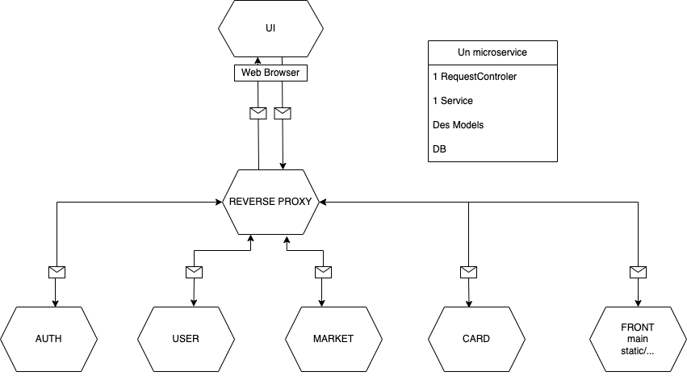

# archi-system-3

# Elements du cahier des charges par membres

Joseph: Mise en place du proxy. Mise en place test http pour Card Service et User. Mise en place service card

Adrien: Légères modification front, travaillé sur le service market (back)

Pierre-Louis: Auth service. Front index, fight, addCard, maintenance du site de test.

Hugues: Intégration de différents services. Module DTO. Finission du front market. 

# Elements du cahier des charges non réalise

- Fight module théoriquement fontionnel. Pas pu testé ni faire le front

## Note

Un Cookie est un seul objet clé: valeur. On ne peut pas avoir un cookie tel que user={id: 1, name: "toto"}. Il faut faire deux cookies: user_id=1 et user_name=toto.

## Architecture Diagram

Notre architecture sera composé de 7 (le fight service n'étant pas présent) Services :

Chaques services sera construit comme ci-dessous :

## Proxy

Pour communiquer entre les services, nous utilisons un proxy Nginx qui permet de faire des communiquer entre les services.

## Auth Service 

Permet de s'authentifier grace a un mail et un mot de passe. Ainsi on obtiens on uuid qui sera stocker comme cookie dans le browser. Il permettra de s'identifier pour les autres services.

## User Service

Permet de gérer les utilisateurs: Il doit d'abord etre authentifié, puis ici on aura un résumé du profil de l'utilisateur: son id, l'id de ses cartes, son argent.

## Card Service

Permet de stocker les cartes, selon l'id de l'utilisateur. On peut ajouter une carte, les supprimer, les modifier, et les consulter.

## Transaction Service

Permet de faire des transactions entre les utilisateur. On peut faire des transactions pour se faire de l'argent. On stock les quelles sont en vente et permet de les acheter.
-> gestion du changement de proprietaire de la carte dans CardService, gestion des transfert l'argent dans UserService

## Front Service

Permet seulement de mettre en ligne les fichier html, css et js.

## Partage des objet DTO avec une Maven Common Library

Pour partager les objets DTO entre les services, nous avons créé une librairie Maven qui contient les objets DTO et les interfaces des services.

## TODO

[ ] - Fight service front
